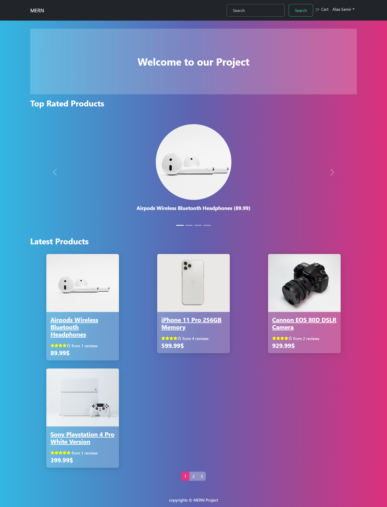
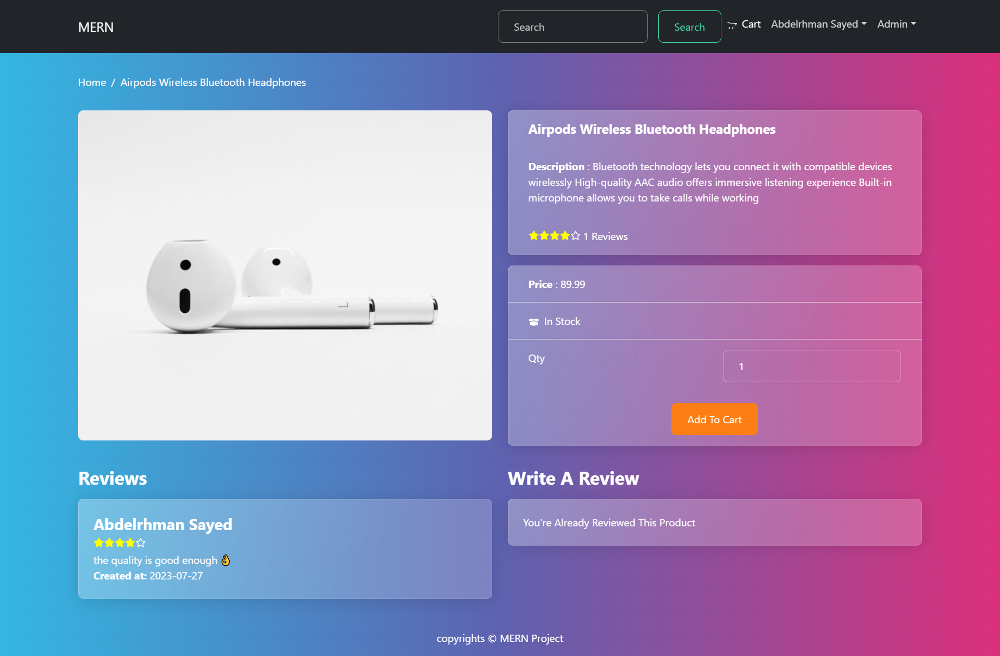
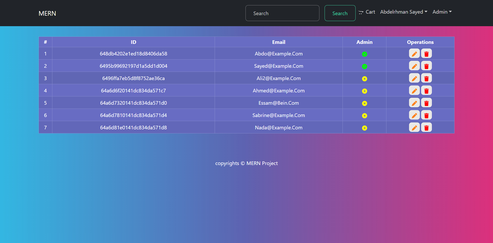

<h1>MERN E-commerce Application</h1>

<h2>Project objectives:</h2>
<p>- Learn more about Redux (State Managment).</p>
<p>- Use new React library npm packs.</p>
<p>- Learn more about Nodejs backend stack including (Mongodb, Mongoose, Express)</p>

<h2>How to set up the app locally ?</h2>

1. Clone this repository to your local machine:
   ```bash
   git clone https://github.com/AbdoSadory/mernApp.git
   ```
2. Install npm packages in root folder and in front-end folder:
   ```bash
   npm install
   ```
3. Start the local server in root folder:
   ```bash
   npm run dev
   ```

<h2>Packages have been used</h2>

1. <a href="https://react-bootstrap.netlify.app/" target="_blank">React-Bootstrap</a>
2. <a href="https://www.npmjs.com/package/react-rating" target="_blank">React Rating</a>
3. <a href="https://www.npmjs.com/package/react-router-bootstrap" target="_blank">React Router Bootstrap</a>
4. <a href="https://bootswatch.com/" target="_blank">Bootswatch</a>
5. <a href="https://www.npmjs.com/package/concurrently" target="_blank">Concurrently</a>
6. <a href="https://www.npmjs.com/package/colors" target="_blank">Colors</a>
7. <a href="https://www.npmjs.com/package/bcryptjs" target="_blank">Bcrypt.js</a>
8. <a href="https://www.npmjs.com/package/express-async-handler/v/1.1.4" target="_blank">Express async handler</a>
9. <a href="https://www.npmjs.com/package/multer" target="_blank">Multer</a>
10. <a href="https://www.npmjs.com/package/toastify-js" target="_blank">toastify.js</a>

## 

## 

## 
